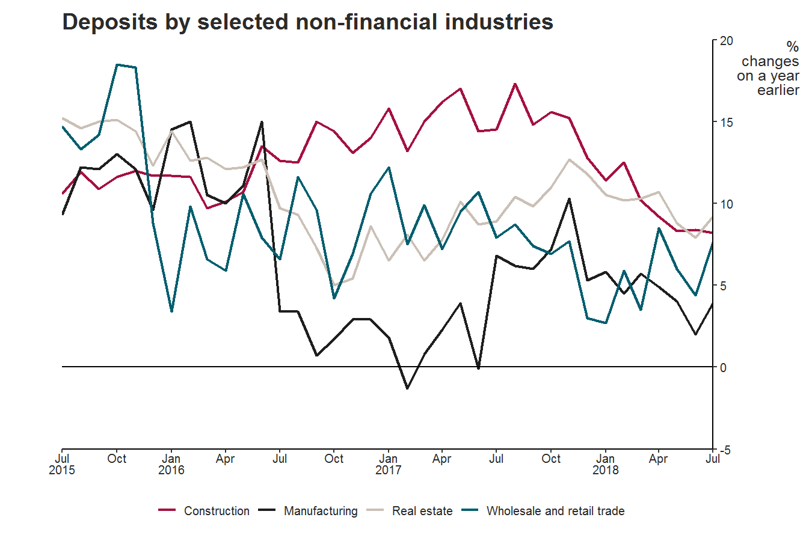

<!-- README.md is generated from README.Rmd. Please edit that file -->
Overview
--------

The **boeCharts** R package contains Bank styles for [ggplot2](https://github.com/hadley/ggplot2) charts. It currently houses designs to help you approximate charts found in:

-   [BoE website](https://www.bankofengland.co.uk/statistics/visual-summaries/effective-interest-rates)
-   [Inflation Report](https://www.bankofengland.co.uk/inflation-report/2018/august-2018/global-economic-and-financial-market-developments)
-   [DSD Statistical Publications](https://www.bankofengland.co.uk/-/media/boe/files/statistics/money-and-credit/2018/february-2018.pdf?la=en&hash=D5A6531045C648B4169D5FD480723AE4CFBD75F9)

Install
-------

Using **boeCharts** also requires the prerequisites described below.

1.  R & R Studio, installed from the [software catalogue](http://sccm-wl-mgt-01/CMApplicationCatalog)

You can install **boeCharts** as follows (from an R session):

``` r
# install remotes (required for installation)
if (!require("remotes")) install.packages("remotes")

# install boeCharts from collaborate
install.packages("http://collaborate/workspaces/RHelpCentre/R%20documents/Packages/boeCharts_1.0.0.zip", repos = NULL, type = "binary")

# install boeCharts' dependencies from CRAN
remotes::install_deps(find.package("boeCharts"))
```

Use
---

``` r
# load packages
library(boeCharts)
library(ggplot2)
#> Warning: package 'ggplot2' was built under R version 3.5.2

# create chart
ggplot(data = FANG, aes(x = date, y = close, colour = symbol)) +
  geom_line(size = 0.7) +
  labs(title = "BoE Palette Test",
       subtitle="A plot for demonstration purposes",
       y="Closing\nprice", x=NULL) +
  # apply boe palette
  scale_colour_boe(palette = "boe") +
  # apply MCG theme
  theme_mcg_pub(axis_text_size = 11) +
  theme(legend.position = "top") +
  # apply axis settings
  scale_y_continuous(expand = c(0, 0), breaks = seq(0, 1250, 250), limits = c(0, 1250), position = "right") +
  scale_x_date(expand = c(0, 0), breaks = seq(min(FANG$date), max(FANG$date), by = "3 months"), labels = boe_date_labels())
```



For more detailed guidance, refer to the package [vignettes](https://tfsapp-liv/tfs/UnmanagedCollection/Shared%20Analytical%20Code/_git/boeCharts?path=%2Fvignettes&version=GBmaster&_a=contents) (also included in the package documentation, accessible from R).

Contribute
----------

This is an ongoing project to abstract and consolidate Bank charting guidelines, and any/all contributions are encouraged. Inspecting the source code in this repository will help with understanding how to make a custom palette, or building a chart theme for your business area. The following resources are also helpful (and inspired much of this effort):

-   [Modify components of a theme](https://ggplot2.tidyverse.org/reference/theme.html)
-   [govstyle](https://github.com/ukgovdatascience/govstyle)
-   [hrbrthemes](https://github.com/hrbrmstr/hrbrthemes)
-   [Building a new theme](https://bookdown.org/rdpeng/RProgDA/building-a-new-theme.html)

Also, for general consideration when contributing to the package:

-   I observed a lot of the principles in Hadley Wickham's [R Packages book](http://r-pkgs.had.co.nz/)
-   Follow the Git fork/pull request model, or [contact Ewen](mailto:ewen.henderson@bankofengland.co.uk)
