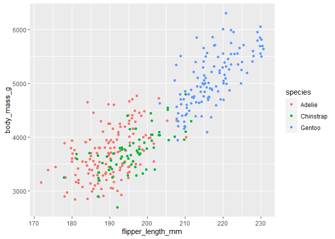
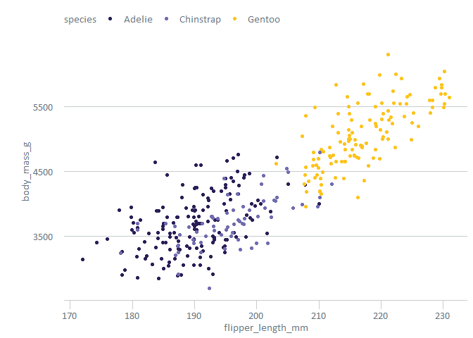
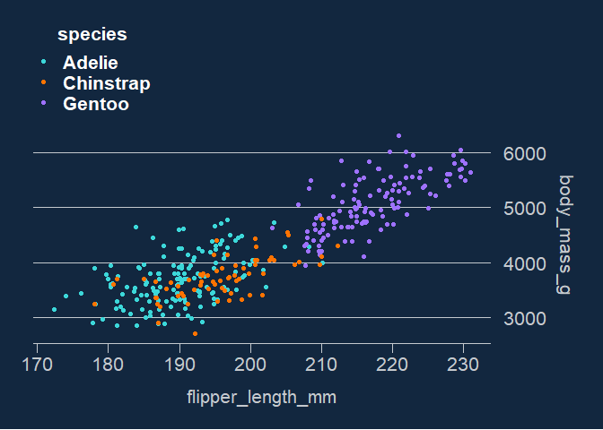
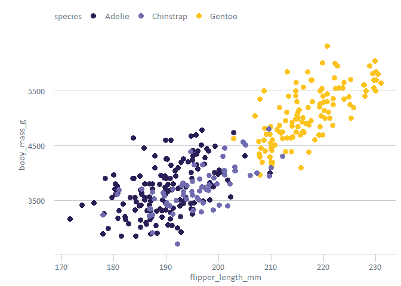
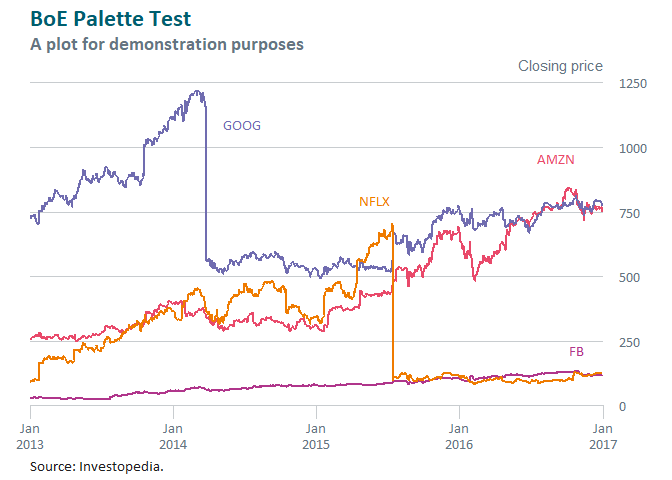
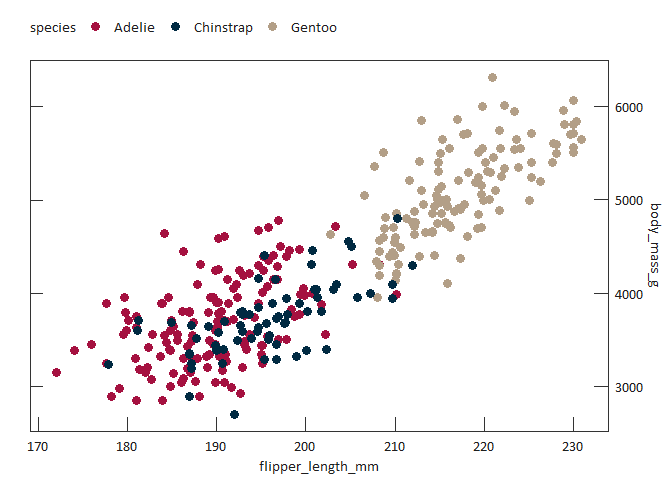

<!-- README.md is generated from README.Rmd. Please edit that file -->

# boeCharts

## Overview

`boeCharts` is an R package to help you create charts that are in-line
with [the Bank’s chart design
guidelines](https://bankofengland.frontify.com/d/KN5KRtH8qzXF/design-guidelines#/brand-applications/chart-design-for-staff),
recommended (and designed) for use in conjunction with
[ggplot2](https://ggplot2.tidyverse.org/).

It also contains design patterns for approximating charts found within
flagship publications, including:

-   [Bank Overground](https://www.bankofengland.co.uk/bank-overground)
-   [Monetary Policy
    Report](https://www.bankofengland.co.uk/monetary-policy-report/2019/november-2019)
    (FKA Inflation Report)
-   [Financial Stability
    Report](https://www.bankofengland.co.uk/financial-stability-report/2019/july-2019)
-   [Statistical
    Releases](https://www.bankofengland.co.uk/statistics/money-and-credit/2019/april-2019)

N.B. this is still a maturing project. Feedback/issues/contributions
appreciated. If you are reporting a bug/error and/or requesting a new
feature, please try and use [the boeCharts
backlog](https://almplatform/tfs/UnmanagedCollection/Shared%20Analytical%20Code/_backlogs/backlog/boeCharts/Requirements).
For questions and other discussion, please use the [Data
Community](https://bankexchange/groups/1067/SitePages/Home.aspx).

## Installation

Install the latest stable version of `boeCharts` from Artifactory with:

``` r
install.packages("boeCharts")
```

You can also install the development version of `boeCharts` like so:

``` r
remotes::install_git(
  "https://almplatform/tfs/UnmanagedCollection/Shared%20Analytical%20Code/_git/boeCharts", 
  git = "external"
)
```

N.B. the development version should only be used for experimentation.
Use the latest stable version, released via Artifactory, in any
production code.

## Usage

### Complementing a ggplot2 worflow

`boeCharts` provides native support for use with
[ggplot2](https://ggplot2.tidyverse.org/) (a popular R graphics
library). You can use `scale_[colour|fill]_[continuous|discrete]_boe`
functions for adopting Bank colour palettes within charts generated by
`ggplot2`, and `theme_xxx` functions for applying full chart styles
supported by `boeCharts`.

#### A minimal example

First, load packages:

``` r
library(boeCharts)
library(ggplot2)
library(palmerpenguins) # for example purposes only
library(scales) # for date examples
```

Here is an out-of-the-box `ggplot2` chart.

``` r
ggplot(penguins, aes(flipper_length_mm, body_mass_g, color = species)) +
  geom_jitter()
```

<!-- -->

Custom themes can be applied to ggplot objects as additional “layers”.
As mentioned above, all `boeCharts` theme functions are prefixed by
`theme_` e.g. `theme_overground()` applies the [Bank
Overground](https://www.bankofengland.co.uk/bank-overground) chart
theme:

``` r
ggplot(penguins, aes(flipper_length_mm, body_mass_g, color = species)) +
  geom_jitter() +
  # add Bank Overground theme
  theme_overground()
```

<!-- -->

Custom ggplot scales help with applying Bank colour palettes. In this
case, the points can be coloured with a “vibrant” Bank colour
combination variant, via `scale_colour_discrete_boe()`, again as an
additional ggplot layer:

``` r
ggplot(penguins, aes(flipper_length_mm, body_mass_g, color = species)) +
  geom_jitter() +
  theme_overground() +
  # add a "vibrant" Bank colour combination
  scale_colour_discrete_boe(palette = "vibrant_c")
```

<!-- -->

Now, switching in the [Monetary Policy
Report](https://www.bankofengland.co.uk/monetary-policy-report/2019/november-2019)
theme and pre-MPC colours. Additionally, `scale_y_continuous()` is used
to move the y-axis across to the right.

``` r
ggplot(penguins, aes(flipper_length_mm, body_mass_g, color = species)) +
  geom_jitter() +
  # add MPR theme
  theme_mpr() +
  # add a "vibrant" Bank colour combination
  scale_colour_discrete_boe(palette = "pre_mpc") +
  # move the y-axis to the right
  scale_y_continuous(
    position = "right", sec.axis = dup_axis(labels = NULL)
    )
```

<!-- -->

#### An in-depth example

Another `ggplot2` + `boeCharts` creation, this time investigating some
more customization options, including:

-   automatic axis breaks/limits (using
    `boe_breaks|limits_date|numeric()`)
-   direct line labels (using `position_voronoi()`)
-   non-standard y-axis title positioning (using `move_ylab()`)
-   markdown

``` r
# create chart
chart <- ggplot(data = FANG, aes(x = date, y = close, colour = symbol)) +
  # add lines + hide legend
  geom_line(lwd = 0.75, lineend = "round", show.legend = FALSE) +
  # add series labels + hide legend
  geom_text(
    aes(label = symbol), position = position_voronoi(), 
    family = "Calibri", show.legend = FALSE
    ) +
  # add some chart labels
  labs(
    title = "Chart 1.2: Historical FANG stock prices",
    subtitle = "Stock price at the close of trading (USD)",
    caption = caption_boe(source = "Investopedia"),
    x = NULL, y = NULL
    ) +
  # use 'highlights' palette
  scale_colour_discrete_boe(palette = "boe_identity") +
  # add Bank Overground theme
  theme_boe_identity() +
  # apply custom axis settings
  scale_y_continuous(
    expand = c(0, 0), breaks = boe_breaks_numeric(), 
    limits = boe_limits_numeric(), position = "right"
    ) +
  scale_x_date(
    expand = c(0, 0), labels = scales::label_date_short(),
    breaks = boe_breaks_date(), limits = boe_limits_date()
    )

# re-position y axis title above plot
move_ylab(chart)
```

<!-- -->

#### Markdown theme variants

A Markdown variant of each {boeCharts} theme has been made with a `md_`
suffix, like `theme_mpr_md()`. These themes add support for rendering
text as markdown, thanks to the
[ggtext](https://wilkelab.org/ggtext/index.html) package. Here’s an
example:

``` r
mpr_chart <- chart +
  # apply custom axis settings
  scale_x_date(
    labels = scales::label_date_short(),
    breaks = boe_breaks_date()
    ) +
  theme_mpr_md(axis_title_size = 9, axis_text_size = 9, caption_size = 9) +
  labs(
    title = "**Chart A.2** Historical FANG stock prices",
    subtitle = 'Daily stock prices for "FB", "AMZN", "NFLX" and "GOOG" (FANG), 2013-2016<sup>(a)</sup>',
    caption = caption_boe(source = "Investopedia", footnote = "A minor data detail.")
    )

move_ylab(mpr_chart)
```

<!-- -->

### Using custom fonts

`boeCharts` helps you safely import and use fonts other than the basic
fonts R already uses (with help from the `extrafont` package). These
fonts can be imported using an associated `import_` utility function.
For example, to import Calibri (used by default in some `boeCharts`
themes), you should run the `import_calibri()` function. If you want to
use fonts in PDF (or Postscript) output files, set the
`boeCharts.loadfonts` option to `TRUE`.

Font import depends on version 1.3.8 of the {rttf2pt1} package being
available. The `install_rttf2pt1()` function is included in {boeCharts}
to help handle this, and is run automatically as part of the `import_`
operations described above.

N.B. the font import step only needs to be run once on your machine.
Fonts will be loaded automatically when you load `boeCharts` in future
sessions.

## More guides/examples

Talks:

-   [Bank-style data viz made
    simple](http://intranet/Banknav/IML.asp?svr=BOE-DMS&db=Analytical&id=8093829&v=0)

Vignettes:

-   [Using
    boeCharts](http://collaborate/workspaces/RHelpCentre/R%20Markdown/using-boeCharts.html)
-   [Bank-standard colours with
    boeCharts](http://collaborate/workspaces/RHelpCentre/R%20Markdown/Bank-standard-colours-with-boeCharts.html)
-   [‘Last-mile’
    formatting](http://collaborate/workspaces/RHelpCentre/R%20Markdown/last-mile-formatting.html)

Cookbooks:

-   [Introduction to boeCharts - produce “Bank-ready” data visualisation
    with
    ggplot2](http://collaborate/workspaces/RHelpCentre/R%20Markdown/boeCharts_intro.html)
-   [Visualising
    Distributions](http://collaborate/workspaces/RHelpCentre/R%20Markdown/ChartsVisualisingDistributions.html)
-   [Other charts from SPERI
    speech](http://collaborate/workspaces/RHelpCentre/R%20Markdown/ChartsOthers.html)

## How to contribute

This is an ongoing project to abstract and consolidate Bank charting
guidelines, and any/all contributions are encouraged. Inspecting the
source code in this repository will help with understanding how to make
a custom palette, or building a chart theme for your business area. The
following resources are also helpful (and inspired much of this effort):

-   [Modify components of a
    theme](https://ggplot2.tidyverse.org/reference/theme.html)
-   [govstyle](https://github.com/ukgovdatascience/govstyle)
-   [hrbrthemes](https://github.com/hrbrmstr/hrbrthemes)

Also, for general consideration when contributing to the package, try
to:

-   Observe principles in Hadley Wickham’s [R Packages
    book](https://r-pkgs.org/)
-   Follow the Git branch (see
    [here](https://blog.rstudio.com/2017/09/13/rstudio-v1.1-the-little-things/)
    for how to create a branch from within R Studio) & [pull
    request](https://docs.microsoft.com/en-us/azure/devops/repos/git/pullrequest?view=azure-devops)
    model, or [contact Ewen](mailto:ewen.henderson@bankofengland.co.uk)
